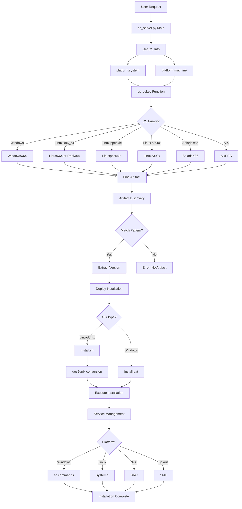
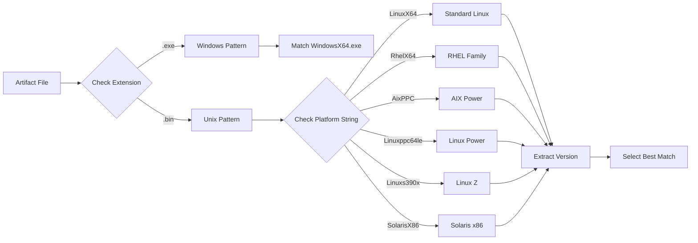
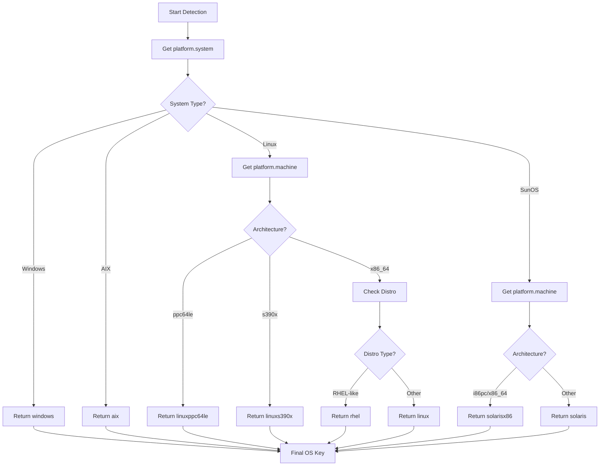
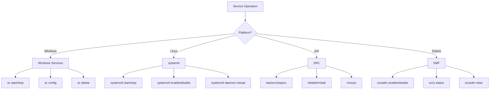
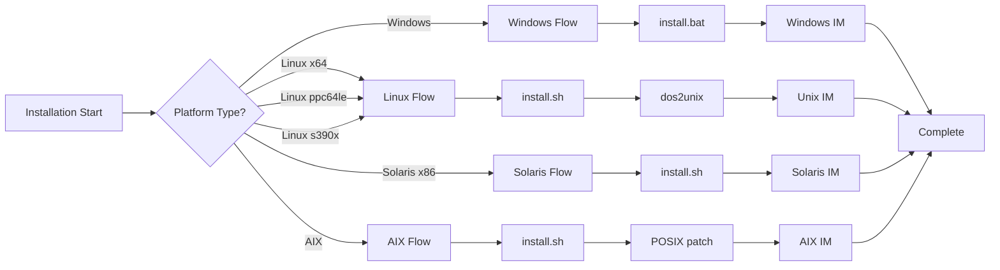

# Platform Support Implementation Architecture

## System Architecture Overview



## Artifact Pattern Matching Flow



## Platform Detection Logic



## Service Management by Platform



## Installation Flow Comparison



## Key Implementation Points

### 1. Architecture Detection
- **Linux ppc64le**: Detected via `platform.machine()` returning `ppc64le` or `ppc64`
- **Linux s390x**: Detected via `platform.machine()` returning `s390x` or `s390`
- **Solaris x86**: Detected via `platform.system()` = `SunOS` + `platform.machine()` = `i86pc`/`x86_64`/`amd64`

### 2. Artifact Naming Convention
All new platforms follow the pattern:
```
<version>-<vendor>-<product>-<platform>.bin

Examples:
- 1.2.3.4-IBM-SPOC-Linuxppc64le.bin
- 1.2.3.4-IBM-SPOC-Linuxs390x.bin
- 1.2.3.4-IBM-SPOC-SolarisX86.bin
```

### 3. Installation Script Compatibility
- **Linux ppc64le & s390x**: Use standard Linux `install.sh` with systemd
- **Solaris x86**: Use `install.sh` with SMF service management
- All require `dos2unix` conversion for line endings

### 4. Service Management Differences

| Platform | Service System | Start Command | Enable Command |
|----------|---------------|---------------|----------------|
| Windows | Windows Services | `sc start` | `sc config start=auto` |
| Linux x64 | systemd | `systemctl start` | `systemctl enable` |
| Linux ppc64le | systemd | `systemctl start` | `systemctl enable` |
| Linux s390x | systemd | `systemctl start` | `systemctl enable` |
| Solaris x86 | SMF | `svcadm enable` | `svcadm enable` |
| AIX | SRC | `startsrc -s` | `mkitab` |
